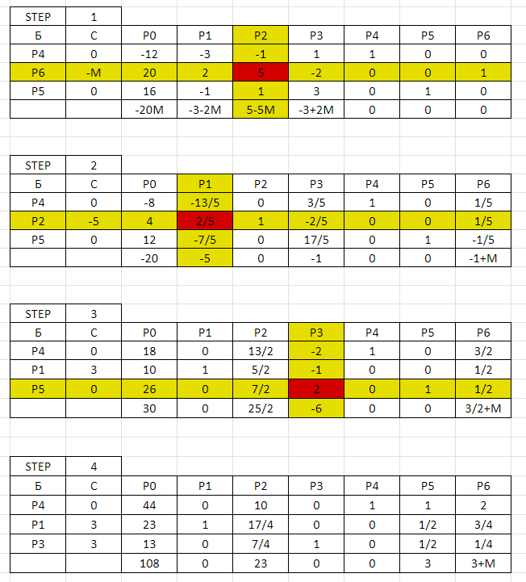

# Gomory solver

Finds a nonnegative integer solution to the problem of minimizing/maximizing a linear function with the linear constraints by the Gomory algorithm and generates an Excel file with the step solution.

## Example
### Input
$$
3x_1 - 5x_2 + 3x_3 \to max
$$

$$
\begin{cases}
3x_1 + x_2 - x_3 \ge 12 \\
2x_1 + 5x_2 - 2x_3 = 20 \\
-x_1 + x_2 + 3x_3 \le 16
\end{cases}
$$

$$
x_j \ge 0, j=\overline{1,3}
$$

### Console output
```
TOTAL NUMBER OF STEPS: 4
F_max=108
X*=(23, 0, 13, 44)
```

### Excel output
<p align="center">
  
</p>

## Used in the project:
* Python
* [Fraction library](https://docs.python.org/3/library/fractions.html)
* [openpyxl library](https://openpyxl.readthedocs.io/en/stable/)
